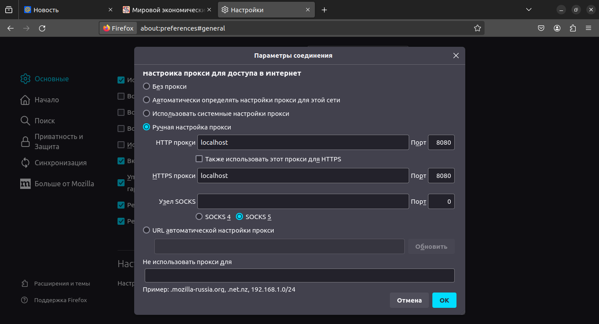
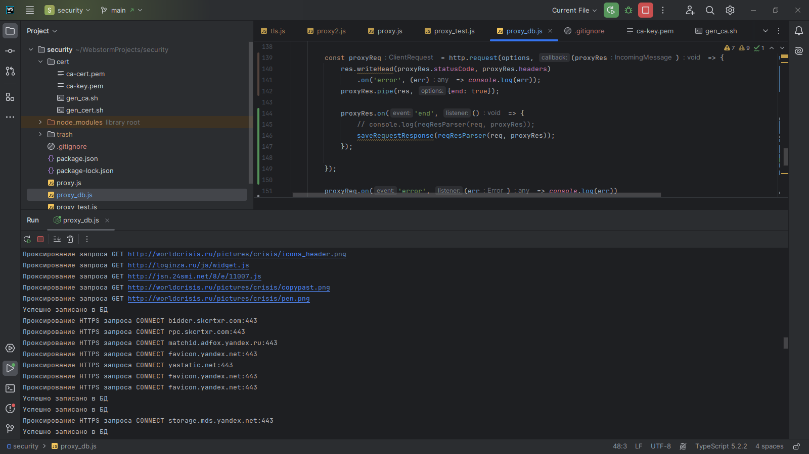
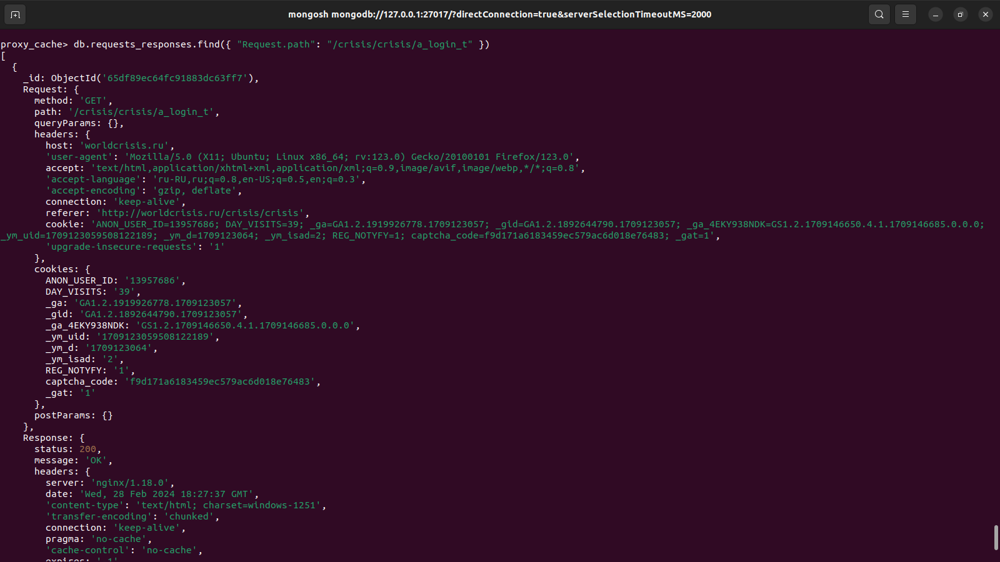

# HTTP / HTTPS Прокси сервер

#### HTTP проскирование настроено

#### HTTPS проксирование настроенно

#### MongoDB поднят и собирет пары запрос-ответ

#### ~~Веб-Апи для работы с запросами~~

#### ~~Сканер уязвимости~~

## Настройка

Предварительно установите необходимые зависимости

```
npm install
```

Для запуска прокси сервера без отслеживания БД запустите скрипт ```proxy.js```

Для работы с записью запросов в БД запустить файл ```proxy_db.js```

## Пример работы сервера и БД

Прокси сервер настроен в браузере FireFox



Отладка в консоли



Содержимое БД

